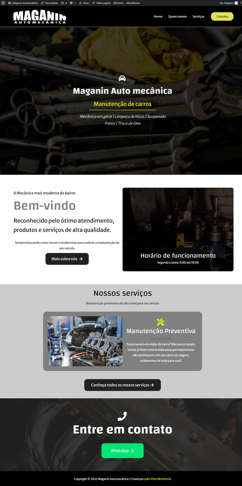

# Site Maganin Automecânica

Estudando sobre WordPress, percebi como é fácil criar um site utilizando construtores prontos, é ótimo para quem não deseja ser programador e quer apenas montar um site pessoal, um portfólio ou uma página de vendas sobre sua loja/produto. Decidi então montar um site para a oficina mecânica do meu irmão já que estava estudando sobre, unindo o útil ao agradável. usando apenas as ferramentas;plugins já prontos do WP e minha criatividade, o resultado foi esse:

Até que ficou bem bonito né?

No momento em que estava construindo, fui percebendo como o WordPress poderia me ajudar a melhorar o meu HTML, CSS e JavaScript pois no WordPress é bem mais intuitivo de ver e enteneder o que cada propriedade e classe pode fazer e alterar em um site.

Sendo assim, decidi criar esse repositório para criar o mesmo site que fiz em WordPress, utilizando HTML, CSS e JavaScript, criando cada uma das páginas e aplicando reponsividade a cada uma delas. No final do projeto, pretendo hospedar gratuitamente em algum lugar para ficar de demonstração aqui no git.

Espero que gostem desse projeto e que sirva de ajuda para quem está começando a estudar sobre front-end assim como eu.
